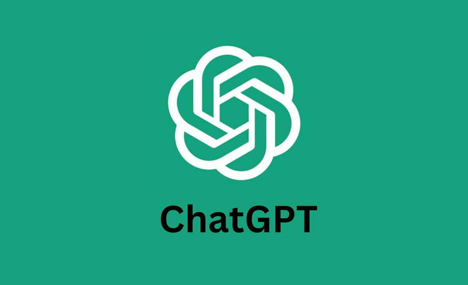

       

# Reflecting on the Role of AI in ICS 314

## I. Introduction

In the context of Software Engineering education, AI plays a pivotal role in enhancing learning experiences. Throughout ICS 314, I've primarily used ChatGPT and have plans to explore GitHub Copilot in the future. AI tools like these have offered significant assistance in problem-solving, code analysis, and essay structuring. AI serves as a supplementary learning tool, aiding in complex problem-solving and expediting information retrieval.

## II. Personal Experience with AI

### WODs
For WODs, I leaned on ChatGPT when I encountered significant challenges. While it was helpful in understanding errors, I refrained from letting AI do everything to ensure a solid grasp of concepts. This balance between utilizing AI for guidance while independently resolving problems seemed optimal for comprehension.

### Essays
AI, particularly ChatGPT, was invaluable in refining technical essays. It efficiently assisted in structuring content, ensuring coherence, and adding transitions. It allowed me to focus on the technical aspects while leaving the polishing to the AI. However, I occasionally found the need to review AI-generated content for contextual accuracy and relevance.

### Final Project
During the final project, ChatGPT played a minor role, mainly used for brainstorming ideas and searching for suitable project names. Its contributions were more towards the initial conceptualization than the actual project implementation. The limited role of AI in the final project emphasized the need for human creativity and critical thinking.

### Learning Concepts/Tutorials
I consciously minimized ChatGPT use during learning sessions to retain information better. Over-reliance on AI seemed to hinder my personal understanding, especially when trying to grasp new concepts. I discovered that actively engaging with course material, rather than relying solely on AI, facilitated deeper learning.

### Class/Discord Questions
Prior to engaging in class or Discord discussions, I consulted ChatGPT for quicker, knowledgeable responses. However, I realized that human interactions, even if slower, often provided more nuanced and interactive solutions. The combination of AI-based responses and peer interactions enriched the learning experience.

### Coding Examples/Quality Assurance
ChatGPT excelled in providing explanations and assisting in code-related tasks effectively. However, its solutions weren't always accurate and required validation and interpretation. The use of AI in code-related tasks expedited problem-solving but demanded critical evaluation for reliable outcomes.

### Other Uses
Useful in brainstorming, creativity-based tasks, team/project names, and styling. However, I realized the importance of human input in decision-making, especially in creative aspects. The AI's suggestions often served as starting points for further human-driven refinement and creativity.

## III. Impact on Learning and Understanding

AI tools like ChatGPT provided confidence and aided problem-solving. They served as helpful tools rather than learning hindrances, allowing quick access to information and suggestions that might have taken hours of internet searches. While AI offered efficiency, the need for independent learning and critical thinking was evident in certain scenarios.

## IV. Practical Applications

While I haven't extensively used ChatGPT outside ICS 314, I believe it holds promise as a learning assistance tool in real-world software engineering scenarios. Its potential in aiding brainstorming sessions, code analysis, and creative tasks could be valuable in professional settings.

## V. Challenges and Opportunities

AI, while beneficial, sometimes delayed solutions that could have been quickly resolved through more traditional means like a Google search. Its limitations in accuracy and context understanding were evident in specific scenarios. The challenge lies in balancing AI's assistance with human input to optimize learning and problem-solving.

## VI. Comparative Analysis

Balancing traditional methods with AI offers comprehensive solutions. AI aids learning but must be balanced with human input to ensure better engagement and knowledge retention. The synergy between AI-driven assistance and traditional learning methodologies enhances the learning experience by amalgamating efficiency and depth.

## VII. Future Considerations

The future of AI in software engineering education holds promise. Continuous advancements should aim at refining AI tools to complement traditional teaching methods better and address limitations like accuracy and contextual understanding. The integration of AI could further evolve to foster a more interactive and personalized learning experience.

## VIII. Conclusion

AI, especially ChatGPT, serves as a powerful learning augmentation tool in software engineering education. Striking a balance between AI and traditional teaching methods can optimize learning experiences by leveraging the strengths of both approaches. This collaborative approach fosters comprehensive learning while nurturing critical thinking and problem-solving skills.
