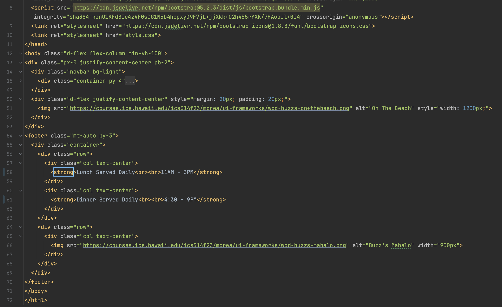

       

## Introduction

In the realm of web development, there's often a debate about the necessity of using UI frameworks like Bootstrap 5. Some argue that they are too complex, while others opt for the simplicity of raw HTML and CSS. In this essay, I'll share my personal journey with Bootstrap 5, highlighting why it's a valuable investment and how it has transformed my web development experience.

## The Initial Hurdles

UI frameworks can indeed appear daunting at first. Bootstrap 5, for instance, posed challenges during my initial encounters. However, these challenges turned out to be stepping stones to a more efficient development process. Bootstrap 5 offers a comprehensive set of pre-designed components, layouts, and styles. Its standout feature is responsiveness, which means your web applications adapt seamlessly to various devices without the need for extensive custom CSS.

## Efficiency Unleashed

Bootstrap 5's true power lies in efficiency and productivity, which I've experienced firsthand:

1. **Pre-designed Components:** Bootstrap offers a wealth of pre-designed UI components, eliminating the need to start from scratch. This significantly reduces development time.

2. **Responsive Grid System:** Bootstrap's grid system simplifies layout design. With a few classes, I can create complex, responsive grids that work flawlessly on different screen sizes.

3. **Consistency:** Bootstrap ensures design consistency across projects, reducing the need to reinvent the wheel each time.

4. **Community and Resources:** Bootstrap boasts a vibrant community, resulting in extensive documentation, tutorials, and ready-made templates. This wealth of resources has made problem-solving a breeze.

5. **Customization:** While Bootstrap provides a solid foundation, it's highly customizable. I can tailor its styles and components to align with my project's unique design vision.

## Software Engineering Benefits

From a software engineering perspective, UI frameworks like Bootstrap offer several advantages:

1. **Maintainability:** Bootstrap encourages a modular approach, simplifying maintenance, updates, and scalability.

2. **Cross-browser Compatibility:** UI frameworks handle cross-browser compatibility, ensuring seamless functioning across different browsers. This saves time on extensive testing and fixes.

3. **Accessibility:** Many UI frameworks prioritize accessibility, delivering semantic HTML elements and ARIA attributes. This makes applications more inclusive and compliant with accessibility standards.

4. **Rapid Prototyping:** UI frameworks are invaluable for rapid prototyping or concept validation. I can quickly assemble UI elements to create functional prototypes without starting from scratch.

## Bootstrap in Action

Now, let's dive into the HTML code I provided for the "Buzz" webpage. Bootstrap plays a pivotal role in crafting a responsive and visually appealing layout:

1. **Navigation Bar:** Bootstrap classes like `navbar`, `nav`, and `nav-link` contribute to creating a clean and responsive navigation bar. Navigation items are thoughtfully organized into justified content sections.

2. **Grid System:** Bootstrap's grid classes (`container`, `row`, and `col`) streamline the page's structure. They ensure content aligns correctly and adjusts seamlessly across diverse screen sizes.

3. **Image Responsiveness:** Bootstrap's default image styles maintain responsiveness for all images on the webpage, including the logo and captivating beach image.

4. **Styling:** Bootstrap's utility classes are harnessed for styling elements throughout the page, ensuring a consistent and aesthetically pleasing design.

## Code Screenshot

                        

## Conclusion

In conclusion, UI frameworks like Bootstrap, despite their initial learning curve, offer unparalleled benefits that transform the web development landscape. My positive experience with Bootstrap 5 mirrors the broader advantages it provides. Embracing UI frameworks empowers developers to create outstanding web applications while saving time and reducing frustration. In today's dynamic digital world, they are a valuable asset in any developer's toolkit.
