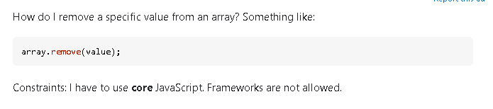

## 

In the vast world of online technical forums, one platform reigns supreme for developers and programmers: Stack Overflow. It's a digital haven where we gather to unravel coding puzzles and seek help when we hit a roadblock. But the language we use to pose our questions makes all the difference. As Eric Raymond noted in his essay "Before You Ask," crafting a well-thought-out question can open doors to a wealth of knowledge and expertise, while a hasty or unclear one can leave both askers and answerers scratching their heads.

In this essay, we'll dive into the dynamic world of Stack Overflow questions. We'll explore two distinct categories: the shining examples that light the path to understanding and the stumbling blocks that sometimes lead us astray. By examining these examples, we hope to uncover the essential ingredients of a successful question and learn from those that miss the mark.

## Good Question

 
A good question is marked by a few things. Good questions are always specific, the question should ask a single well-defined questions per post. Good questions are formatted well, in a way that any reader can easily understand what the asker is trying to convey. If required (in most coding questions it is required), add contextual information. Whether it be a snippet of code or an error message you keep receiving, visually showing what exactly you're working with can help ensure prompt and accurate answers. This question received ~16,000 soultions!

## Bad Question

Here is a good question that shows what you should NOT do when asking questions on stack overflow. The first issue is, this question demonstrates a clear lack of prior research. The user is asking a question that can easily be resolved with Git's existing functionalities. The question is also poorly defined. With the information provided, it is difficult to ascertain the exact nature of the issue, as well as what the user is trying to achieve. This is also a question that has been touched upon many times in the Stack Overflow community. He probably could have found a solution faster with a quick google search.
      

## Final Thoughts

In the ever-expanding universe of online technical forums it is critical for us to refine our question asking skills. This is a skill that is not only crucial for your own success, but will also help contribute to the community where we can all becomer more knowledgeable together. The language we wield when formulating questions holds the power to shape our experience. The most important thing to remember is, good questions bring good answer. As computer science students, we must remember that the art of questioning is as crucial as the pursuit of answers in our ongoing pursuit of technical mastery.
