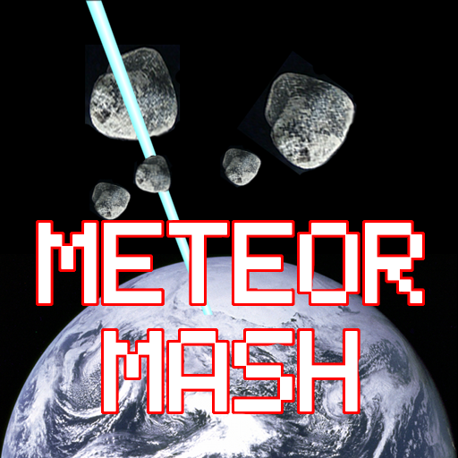

Meteor Mobile was a small game I developed back in 2021. My goal for this project was to understand how to use Unity to create mobile games. I really just wanted to find out what that process was like. After doing lots of research I was constantly being told the same thing. "The best way to get familar with a certain practice, is to dive in on your own and try it for yourself. Through your mistakes and progressions, you will slowly become more familiar with the process. With this project I was able to become more familiar with Unity, C#, and the mobile game development process.
