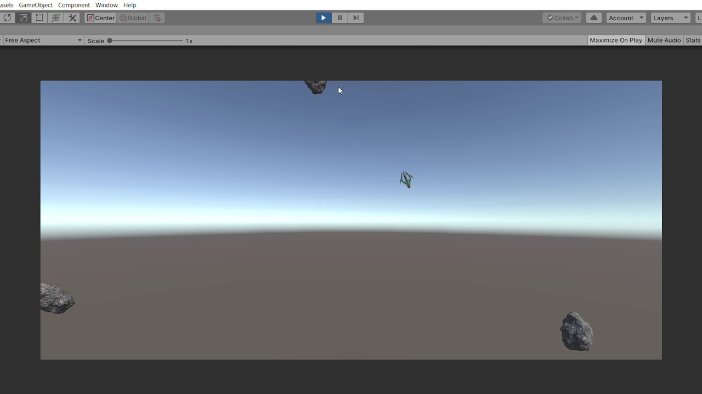

In 2021, I embarked on the development of Meteor Mobile, a small-scale game project aimed at unraveling the intricacies of mobile game creation using Unity. Driven by a desire to comprehend this process firsthand, I heeded the sage advice that often resonates in the world of development: the most effective way to master a craft is to immerse oneself in it. With this mantra guiding my endeavors, Meteor Mobile became a platform where I delved into Unity, honed my skills in C#, and navigated the labyrinthine landscape of mobile game development.

Throughout this endeavor, I steadily gained familiarity with Unity, C#, and the mobile game development process. Meteor Mobile served as an educational canvas, where each mistake metamorphosed into a valuable lesson, and incremental progress allowed me to forge a deeper connection with the art and science of game development. Beyond achieving my initial goal, this project reflects my unwavering commitment to continuous learning and my readiness to embrace challenges in pursuit of knowledge and skill.
